# 🐷 Pigmeus Therapist

**Pigmeus Therapist** es una aplicación integral diseñada para la gestión eficiente de pacientes de terapia física. Permite un control detallado de expedientes, citas y seguimiento de tratamientos, todo en una interfaz moderna y amigable.

---

## 📱 Sistema

La aplicación cuenta con una arquitectura robusta y una navegación intuitiva, permitiendo al terapeuta acceder rápidamente a la información relevante del paciente.

### Navegación y Estructura
El sistema utiliza una navegación fluida entre los diferentes módulos, asegurando que la información esté siempre al alcance.

<p align="center">
  
  
</p>

### Configuración y Perfil
Gestión completa del perfil del terapeuta y configuraciones de la aplicación para adaptar la experiencia a las necesidades del usuario.

<p align="center">
  
  
</p>

---

## 🎨 Temas

La aplicación destaca por su capacidad de personalización, ofreciendo una variedad de temas cuidadosamente diseñados para adaptarse a tus preferencias visuales.

<p align="center">
  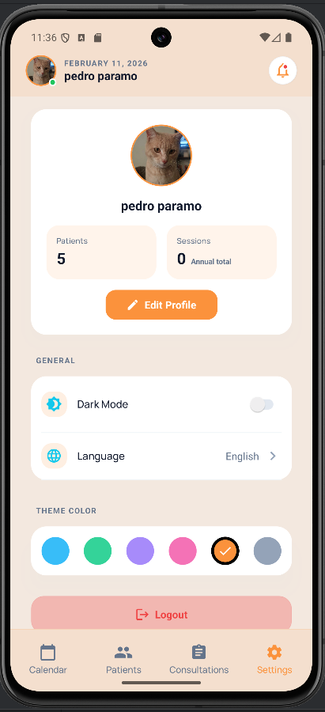
  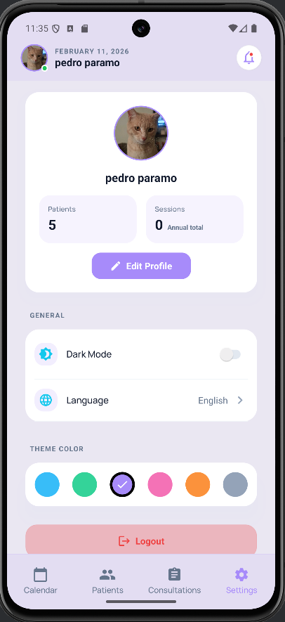
  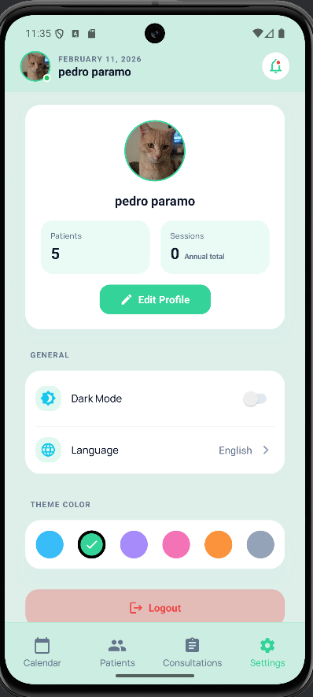
</p>
<p align="center">
  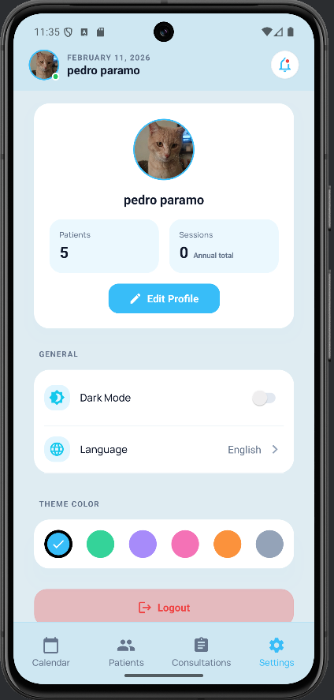
  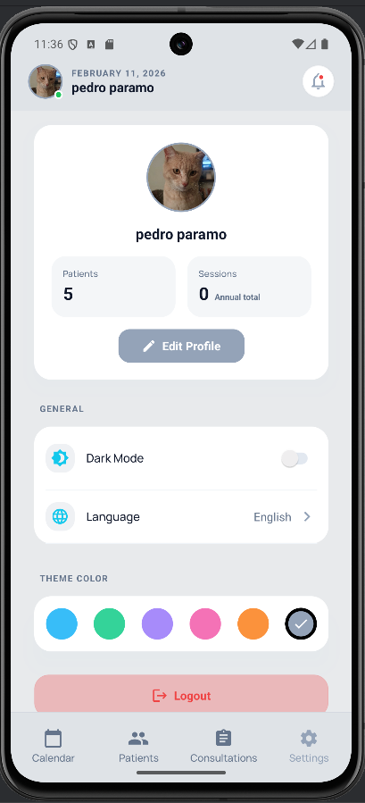
  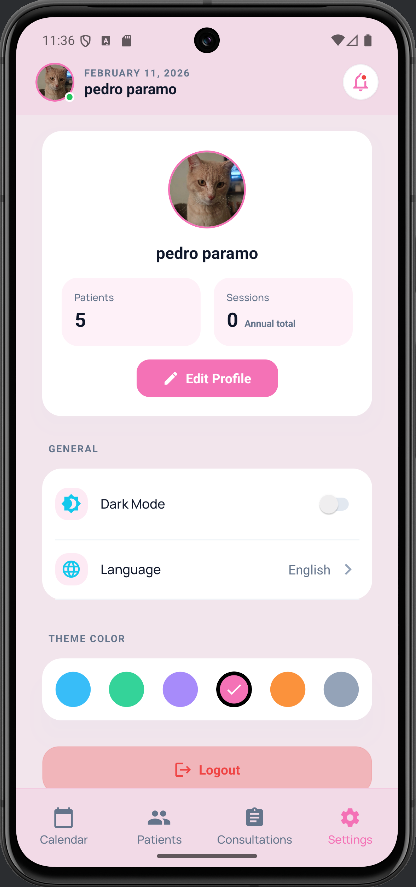
</p>

*   **Tema Claro**: Optimizado para entornos con buena iluminación.
*   **Tema Oscuro**: (En desarrollo).

> **Nota**: Se recomienda utilizar el **Tema Claro** para la mejor experiencia visual en esta versión.

---

## 👥 Pacientes

El módulo de pacientes es el corazón de la aplicación, permitiendo una gestión exhaustiva de los expedientes clínicos.

### Gestión Integral
Visualiza la lista completa de pacientes con opciones rápidas de búsqueda y filtrado. Accede a los detalles de cada expediente con un solo toque.

<p align="center">
  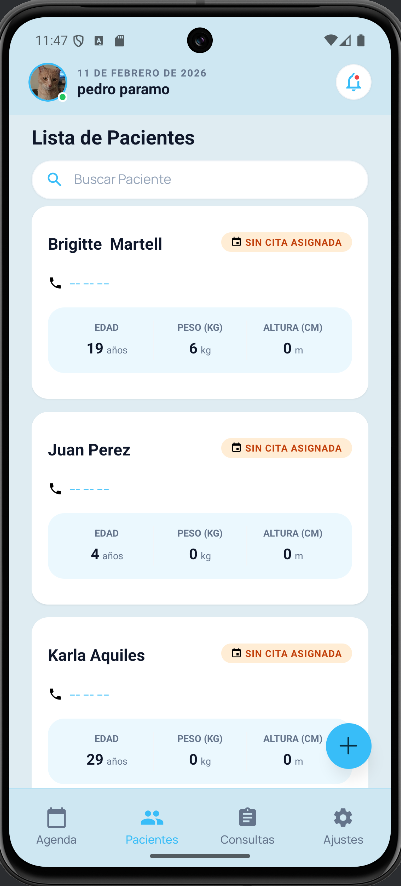
  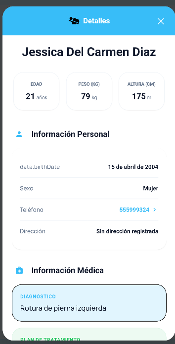
</p>

### Registro y Edición
Formularios intuitivos para dar de alta nuevos pacientes o actualizar su información médica y personal en cualquier momento.

<p align="center">
  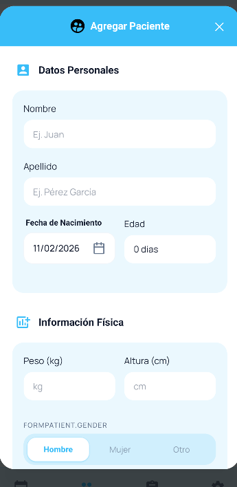
</p>

---

## 📅 Citas

Optimiza tu tiempo con un sistema de gestión de citas ágil y flexible.

### Agenda y Detalles
Mantén el control de tus sesiones con una vista clara de las citas programadas. Consulta los detalles de cada sesión, incluyendo el estado (pendiente, completada, cancelada).

<p align="center">
  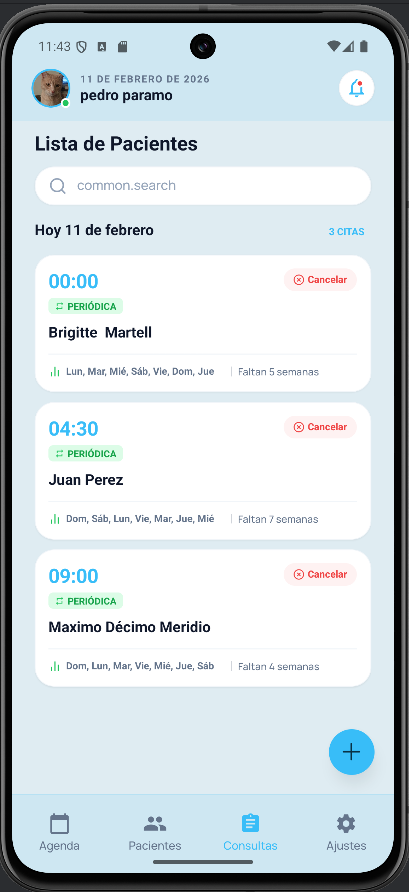
  
</p>

### Programación Avanzada
Crea nuevas citas fácilmente, selecciona pacientes existentes y configura sesiones recurrentes si es necesario.

<p align="center">
  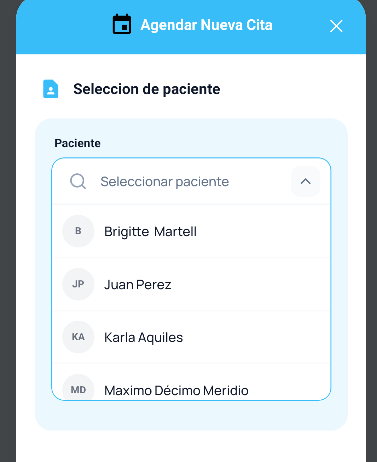
  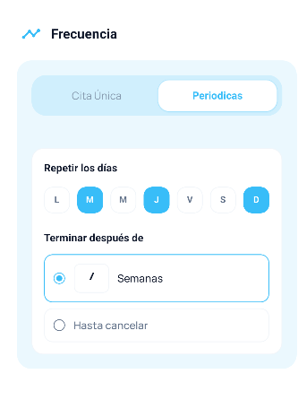
</p>

---

## 🗓 Calendario

Visualiza tu carga de trabajo de manera global para una mejor organización.

### Panorama Mensual y Semanal
El calendario te permite identificar rápidamente los días con mayor actividad y los espacios disponibles.

<p align="center">
  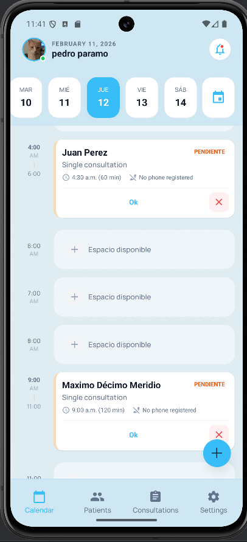
</p>

### Navegación Rápida
Desplázate entre meses y semanas con facilidad para planificar a futuro.

<p align="center">
  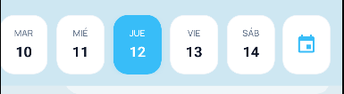
</p>

---

## 🚀 Requisitos e Instalación

### Prerrequisitos
Asegúrate de tener instalado:
1.  **Node.js**: [Descargar aquí](https://nodejs.org/).
2.  **Yarn**: `npm install -g yarn`
3.  **Expo Go**: En tu dispositivo móvil ([Android](https://play.google.com/store/apps/details?id=host.exp.exponent) / [iOS](https://apps.apple.com/us/app/expo-go/id982107779)).

### ⚠️ Importante: Configuración del Entorno (.env)
Este repositorio **NO incluye el archivo `.env`** por razones de seguridad. Este archivo es necesario para conectar con los servicios de Firebase.
*   Si eres colaborador, solicita las credenciales al administrador del proyecto.
*   Si estás probando el proyecto por tu cuenta, deberás crear tu propio proyecto en Firebase y configurar las variables de entorno correspondientes.

### Pasos para Ejecutar
1.  Clonar el repositorio y navegar a la carpeta:
    ```bash
    cd pigmeus-therapist
    ```
2.  Instalar dependencias:
    ```bash
    yarn install
    ```
3.  Iniciar el servidor de desarrollo:
    ```bash
    npx expo start -c
    ```
4.  Escanear el código QR con **Expo Go**.

---

## 🔑 Credenciales de Prueba

Para facilitar la evaluación de la aplicación, se proporcionan las siguientes credenciales de acceso. Estas credenciales funcionan tanto en el entorno de desarrollo (si se configura la BD correctamente) como en el APK de prueba adjunto.

> **Archivo APK**: En la raíz del proyecto encontrarás el archivo `application-....apk` listo para instalar en dispositivos Android.

| Rol | Usuario | Contraseña |
| :--- | :--- | :--- |
| **Terapeuta** | `pedro@gmail.com` | `123456` |

---

## 📚 Documentación Adicional

Para profundizar en la arquitectura, componentes y guías de desarrollo, revisa el directorio:
👉 [**Carpeta de Documentación**](./Documentacion)
