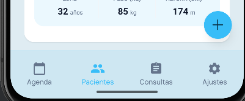
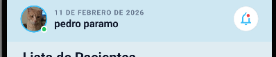
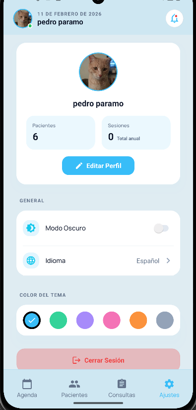
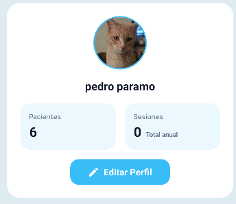

# 🐷 Pigmeus Therapist

**Pigmeus Therapist** es una aplicación integral diseñada para la gestión eficiente de pacientes de terapia física. Permite un control detallado de expedientes, citas y seguimiento de tratamientos, todo en una interfaz moderna y amigable.

---

## 📱 Sistema

La aplicación cuenta con una arquitectura robusta y una navegación intuitiva, permitiendo al terapeuta acceder rápidamente a la información relevante del paciente.

### Navegación y Estructura
El sistema utiliza una navegación fluida entre los diferentes módulos, asegurando que la información esté siempre al alcance.

<p align="center">
  
  
</p>

### Configuración y Perfil
Gestión completa del perfil del terapeuta y configuraciones de la aplicación para adaptar la experiencia a las necesidades del usuario.

<p align="center">
  
  
</p>

---

## 🎨 Temas

La aplicación está diseñada pensando en la comodidad visual del usuario, ofreciendo soporte para temas.

*   **Tema Claro**: Optimizado para entornos con buena iluminación.
*   **Tema Oscuro**: (En desarrollo) Ideal para reducir la fatiga visual en entornos oscuros.

> **Nota**: Se recomienda utilizar el **Tema Claro** para la mejor experiencia visual en esta versión.

Para más detalles sobre la personalización, consulta la carpeta `Documentacion/Tema`.

---

## 🛠 Funciones Generales

El sistema se divide en módulos funcionales clave para cubrir todas las necesidades de la práctica terapéutica:

### 👥 Pacientes
Módulo central para la administración de expedientes.
*   **Registro**: Alta de nuevos pacientes con información detallada.
*   **Historial**: Seguimiento completo de la evolución del paciente.
*   **Gestión**: Edición y actualización de datos personales y médicos.

### 📅 Citas
Control total de la agenda del terapeuta.
*   **Programación**: Agendado rápido de sesiones.
*   **Recordatorios**: Visualización clara de las próximas citas.
*   **Estado**: Seguimiento de citas realizadas, pendientes o canceladas.

### 🩺 Consultas
Registro clínico de cada sesión.
*   **Notas de Evolución**: Documentación detallada del progreso por sesión.
*   **Diagnóstico**: Registro de evaluaciones y planes de tratamiento.

### 🗓 Calendario
Vista global de las actividades.
*   **Organización Visual**: Panorama mensual o semanal de la carga de trabajo.
*   **Sincronización**: Integración con las citas programadas.

---

## 🚀 Requisitos e Instalación

### Prerrequisitos
Asegúrate de tener instalado:
1.  **Node.js**: [Descargar aquí](https://nodejs.org/).
2.  **Yarn**: `npm install -g yarn`
3.  **Expo Go**: En tu dispositivo móvil ([Android](https://play.google.com/store/apps/details?id=host.exp.exponent) / [iOS](https://apps.apple.com/us/app/expo-go/id982107779)).

### ⚠️ Importante: Configuración del Entorno (.env)
Este repositorio **NO incluye el archivo `.env`** por razones de seguridad. Este archivo es necesario para conectar con los servicios de Firebase.
*   Si eres colaborador, solicita las credenciales al administrador del proyecto.
*   Si estás probando el proyecto por tu cuenta, deberás crear tu propio proyecto en Firebase y configurar las variables de entorno correspondientes.

### Pasos para Ejecutar
1.  Clonar el repositorio y navegar a la carpeta:
    ```bash
    cd pigmeus-therapist
    ```
2.  Instalar dependencias:
    ```bash
    yarn install
    ```
3.  Iniciar el servidor de desarrollo:
    ```bash
    npx expo start -c
    ```
4.  Escanear el código QR con **Expo Go**.

---

## 🔑 Credenciales de Prueba

Para facilitar la evaluación de la aplicación, se proporcionan las siguientes credenciales de acceso. Estas credenciales funcionan tanto en el entorno de desarrollo (si se configura la BD correctamente) como en el APK de prueba adjunto.

> **Archivo APK**: En la raíz del proyecto encontrarás el archivo `application-....apk` listo para instalar en dispositivos Android.

| Rol | Usuario | Contraseña |
| :--- | :--- | :--- |
| **Terapeuta** | `pedro@gmail.com` | `123456` |

---

## 📚 Documentación Adicional

Para profundizar en la arquitectura, componentes y guías de desarrollo, revisa el directorio:
👉 [**Carpeta de Documentación**](./Documentacion)
